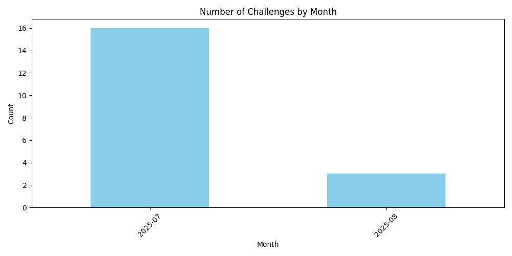
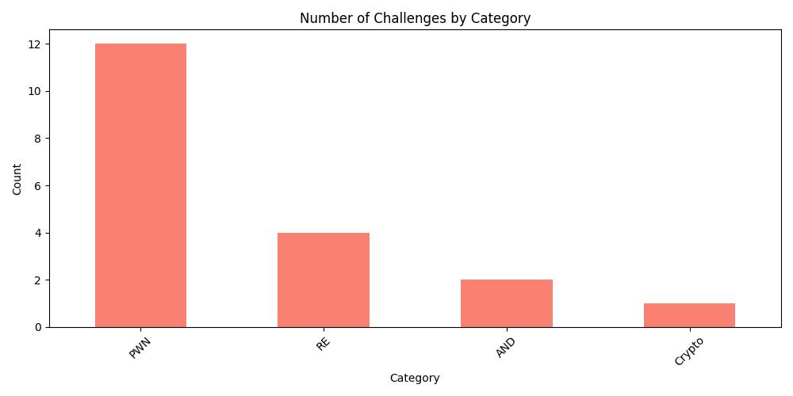
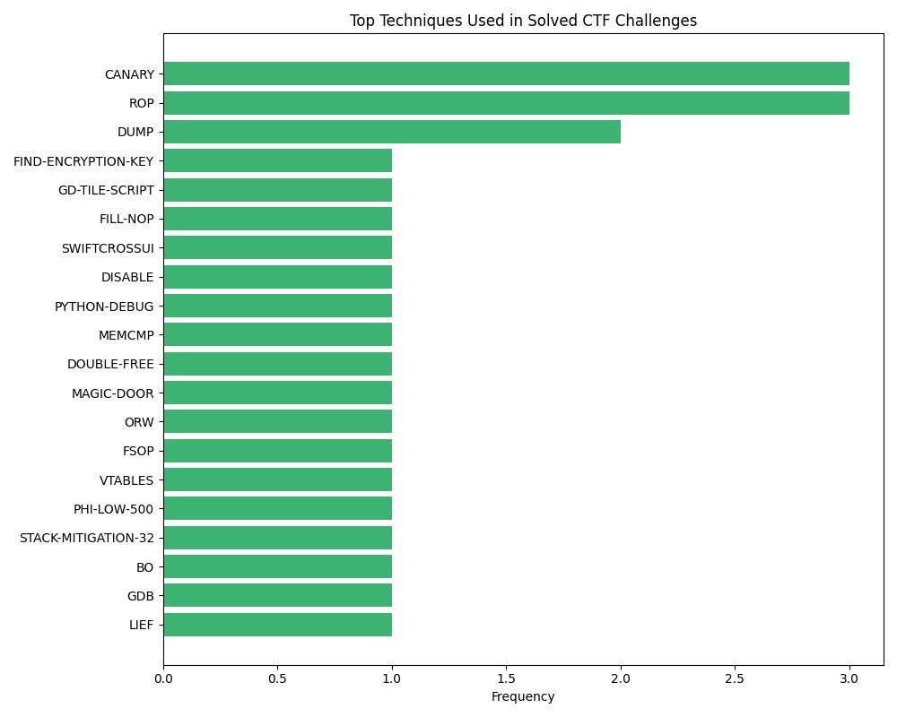

| Category | CTF Name | Challenge Name | Type | Description | Date | Solved |
|----------|----------|----------------|------|-------------|------|--------|
| RE | DownUnderCTF-25 | GODOT | FIND-ENCRYPTION-KEY gd-tile-script | 1. go dot encrypted with a key, how to find it? 2. what we need to focus in godot decompiling? | 2025-08-08 | ✅ Yes |
| RE | DownUnderCTF-25 | SKIPPY | FILL-NOP | 1. why stop at middle anything stop it? 2. how to NOP it | 2025-08-08 | ✅ Yes |
| RE | DownUnderCTF-25 | SWIFTPASSWORDMANAGER CLICK ME | SWIFTCROSSUI disable | 1. where is the button visibility function? | 2025-08-08 | ✅ Yes |
| PWN | Cydes-25 | notify |  | # 2.0 Analysis | 2025-08-07 | ❌ No |
| PWN | DownUnderCTF-25 | fakeobj.py | python-debug | 1. how to debug python script 2. how to overwrite python 3.9 obj? | 2025-08-07 | ✅ Yes |
| RE | DownUnderCTF-25 | ROCKY | MEMCMP | 1. HOW TO BREAK MEMCMP? | 2025-08-07 | ✅ Yes |
| PWN | Cyber-Apocalypse-25 | Strategist | Double-free | 1. how to leak libc? 2. how to use the double free to build payload? 3. where to inject? | 2025-08-06 | ❌ No |
| PWN | L3AKCTF-25 | Chunky Threads | CANARY ROP | 1. where is the leaking point? 2. how to find the canary? 3. canary rec, why need + b'\0' 4. leak stack find libc base 5. how to build ROP | 2025-08-04 | ✅ Yes |
| PWN | STACKSMASH-25 | Refreshments | HOUSE-OF-ORANGE | No description. | 2025-08-04 | ❌ No |
| PWN | TyphoonCon-23 | BookManager | Double-free magic-door | 1. HOW TO LEAK libc? 2. how to build payload 3. heap where to inject? 4. double free Attack flow ? | 2025-08-04 | ✅ Yes |
| PWN | TyphoonCon-23 | ECHO TIME | CANARY ORW | 1. leak canary libc pie 2. seccomp disable execve 3. HOW TO build orw payload？ | 2025-08-04 | ✅ Yes |
| PWN | STACKSMASH-25 | jumpios_love_letter | FSOP vtables | 1. how to leak? 2. what is FSOP 3. where to inject? 4. how to find buffer? | 2025-08-03 | ✅ Yes |
| PWN | STACKSMASH-25 | super_jumpio_kart | canary ROP | 1. leak canary 2. how to find BO offset 3. send payload canary offset | 2025-08-03 | ✅ Yes |
| PWN | WDB-24 | pwn1 BH |  | # 2.0 Analysis | 2025-07-31 | ❌ No |
| PWN | WDB-24 | pwn4 QL | UAF ORW | 1. UNKNOWN username password, brute with bad compare function? | 2025-07-31 | ❌ No |
| AND | L3AKCTF-25 | Androbro | so cannot match | # 2.0 Analysis | 2025-07-30 | ❌ No |
| AND | L3AKCTF-25 | FileStorage | so cannot match | # 2.0 Analysis | 2025-07-30 | ❌ No |
| Crypto | DeadSec-25 | infant RSA | phi-low-500 | 1. phi & ((1 << 500)-1) do what? 2. how to use this hint to get p / q? | 2025-07-27 | ✅ Yes |
| PWN | WDB-24 | pwn2 QL | STACK-MITIGATION-32 | 1. why after system show sh: 1: \x0c-#: not found? 2. not enough buffer, how ? 3. how to generate stack mitigation payload | 2025-07-27 | ✅ Yes |
| PWN | L3AKCTF-25 | Safe Gets | BO | 1. strlen -> /x00 to stop the checking 2. python wrapper only 0xff -> can use emoji in python on 1 length, but for c is 4 bytes | 2025-07-23 | ✅ Yes |
| RE | L3AKCTF-25 | ALPHA | GDB dump lief extract VM instruction | 1. HOW TO DUMP? with gdb script 2. what is the VM instruction? 3. z3 solve with instruction? | 2025-07-23 | ✅ Yes |
| RE | L3AKCTF-25 | PAC | DUMP MEMORY FILENAME START END | 1. Why decompile code so less? 2. How to dump it? 3. How to list stack variable value | 2025-07-23 | ✅ Yes |
| RE | L3AKCTF-25 | USELESS VM | JS-DEBUG | 1. HOW TO DEBUG JS 2. WHERE TO debug? | 2025-07-23 | ✅ Yes |
| PWN | L3AKCTF-25 | THE GOOSE | ret2shellcode | 1. how to predict the rand ? 2. Python’s way of **getting the first byte as an integer**. 3. what position to format string 4. ret2libc or ret2shellcode 5. how to find buffer address 6. why need asm nop in shellcode | 2025-07-21 | ✅ Yes |
| RE | L3AKCTF-25 | JUST BUN IT | cyclic algo MOD | 1. why the code so messy? 2. find the pattern of result after run the elf 3. MOD | 2025-07-20 | ✅ Yes |
| PWN | L3AKCTF-25 | Go Write Where | WWW SYSCALL ROP | 1. typical Write Where What challenge 2. what address to write ? 3. write what value? 4. can only write once, how to increase LOOP 5. no libc no system, can only syscall 6. HOW to build syscall ROP? | 2025-07-17 | ✅ Yes |

## 📊 Challenge Stats
### Challenges by Month

### Challenges by Category

### Challenge Techniques (Top 20)

